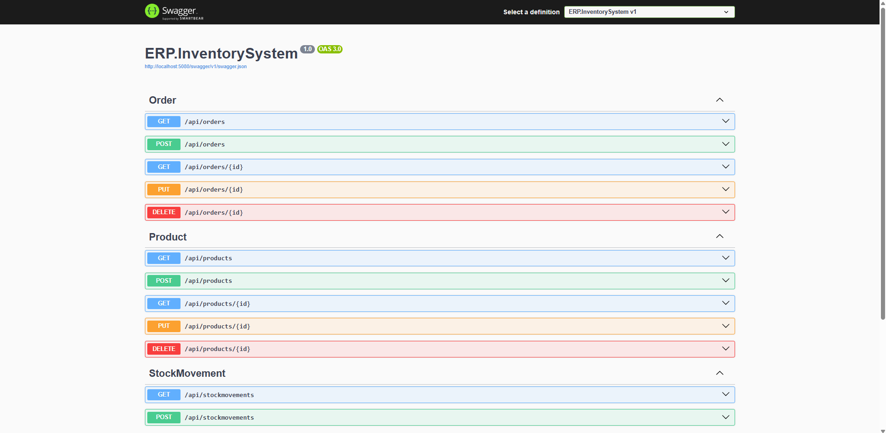

# ERP.InventorySystem 🏢📦



**ERP.InventorySystem** is a backend project built with **C# and ASP.NET Core** for **inventory management**.  
This system allows users to **manage products, track stock movements, and process orders efficiently**.

## 🚀 Technologies Used  
This project utilizes the following technologies:  
- **ASP.NET Core 8.0**  
- **Entity Framework Core 9.0**  
- **PostgreSQL**  
- **Dependency Injection**  
- **Repository & Service Pattern**  
- **Middleware (Exception Handling, Logging)**  

---

## 📌 Setup and Installation  

### 1️⃣ **Clone the Repository**  
```sh
git clone https://github.com/mustafa-bagci/ERP.InventorySystem.git
cd ERP.InventorySystem
```

### 2️⃣ **Install Dependencies**  
```sh
dotnet restore
```

### 3️⃣ **Configure the Database (PostgreSQL Required!)**  
Edit the **appsettings.json** file and update the database connection string:  

```json
"ConnectionStrings": {
  "DefaultConnection": "Host=localhost;Port=5432;Database=erp_inventory;Username=yourusername;Password=yourpassword"
}
```

### 4️⃣ **Apply Migrations and Update Database**  
```sh
dotnet ef database update
```

### 5️⃣ **Run the Application**  
```sh
dotnet run
```

The API will start running on:  
- **http://localhost:5000** (HTTP)  
- **http://localhost:5001** (HTTPS)  

---

## 📌 API Endpoints  

### 🔹 **Products**  
- **`GET /api/products`** → Get all products  
- **`POST /api/products`** → Add a new product  
- **`PUT /api/products/{id}`** → Update a product  
- **`DELETE /api/products/{id}`** → Delete a product  

### 🔹 **Stock Movements**  
- **`GET /api/stockmovements`** → Get all stock movements  
- **`POST /api/stockmovements`** → Register a stock movement  

### 🔹 **Orders**  
- **`GET /api/orders`** → Get all orders  
- **`POST /api/orders`** → Create an order  

---

## 📌 Project Structure  

```
/ERP.InventorySystem
│── /Controllers
│   ├── ProductController.cs
│   ├── StockMovementController.cs
│   ├── OrderController.cs
│
│── /Services
│   ├── IProductService.cs
│   ├── ProductService.cs
│   ├── IStockMovementService.cs
│   ├── StockMovementService.cs
│   ├── IOrderService.cs
│   ├── OrderService.cs
│
│── /Repositories
│   ├── IProductRepository.cs
│   ├── ProductRepository.cs
│   ├── IStockMovementRepository.cs
│   ├── StockMovementRepository.cs
│   ├── IOrderRepository.cs
│   ├── OrderRepository.cs
│
│── /Data
│   ├── ApplicationDbContext.cs
│   ├── DbInitializer.cs
│
│── /Models
│   ├── Product.cs
│   ├── StockMovement.cs
│   ├── Order.cs
│
│── /DTOs
│   ├── ProductDTO.cs
│   ├── StockMovementDTO.cs
│   ├── OrderDTO.cs
│
│── /Middleware
│   ├── ExceptionHandlingMiddleware.cs
│
│── Program.cs
│── README.md
```

---

## 📌 Contribution  

If you’d like to contribute:  
1. **Fork** this repository  
2. **Create a new branch** (`feature-branch`)  
3. **Make your changes** and **commit**  
4. **Push** the branch and submit a **Pull Request**  

---

## 📌 License  
This project is licensed under the **MIT License**.